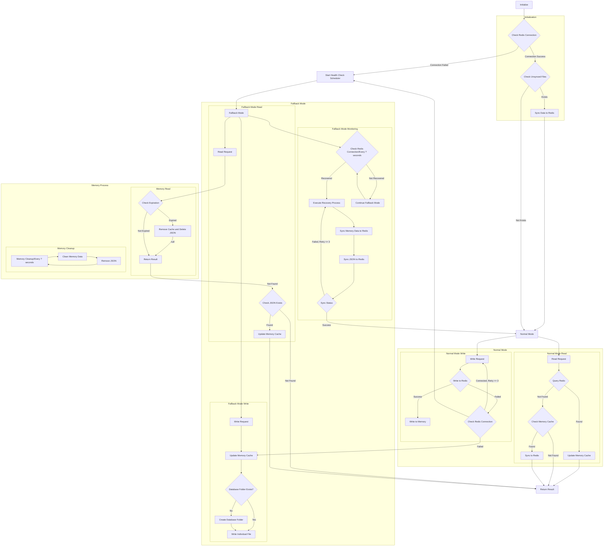

> [!Note]
> This content is translated by LLM. Original text can be found [here](README.zh.md)

# Redis Fallback

> A Golang Redis fallback solution that automatically switches to local storage when the connection is unavailable and restores data when the connection is recovered.
>
> Inspired by the integration concepts of [php-redis](https://github.com/pardnchiu/php-redis), [php-cache-fallback](https://github.com/pardnchiu/php-cache-fallback), and [php-session-fallback](https://github.com/pardnchiu/php-session-fallback).

[](https://pkg.go.dev/github.com/pardnchiu/go-redis-fallback)
[](https://goreportcard.com/report/github.com/pardnchiu/go-redis-fallback)
[](https://app.codecov.io/github/pardnchiu/go-redis-fallback)
[](https://github.com/pardnchiu/go-redis-fallback/releases)
[](LICENSE)<br>
[](README.md)
[](README.zh.md)

## Key Features

### Three-Tier Storage Architecture
Memory cache + Redis + local file storage with automatic fault tolerance.

### Graceful Fallback and Auto-Recovery
Monitors Redis health during fallback and automatically synchronizes data and cleans local files upon recovery.

### Ensuring Data Integrity
Stores data as JSON files during fallback mode to prevent loss, with TTL support.

## Flowchart

<details>
<summary>Click to view</summary>



</details>

## Dependencies

- [`github.com/redis/go-redis/v9`](https://github.com/redis/go-redis/v9)
- [`github.com/pardnchiu/go-logger`](https://github.com/pardnchiu/go-logger)<br>
  If you don't need it, you can fork and replace it with your preferred logger. You can also vote [here](https://forms.gle/EvNLwzpHfxWR2gmP6) to let me know.

## Usage

### Installation

> [!NOTE]
> Latest commits may change. Recommended to use tagged versions.<br>
> Commits containing only documentation updates or non-functional changes will be rebased later.

```bash
go get github.com/pardnchiu/go-redis-fallback@[VERSION]

git clone --depth 1 --branch [VERSION] https://github.com/pardnchiu/go-redis-fallback.git
```

### Initialization
```go
package main

import (
  "log"
  "time"
  
  rf "github.com/pardnchiu/go-redis-fallback"
)

func main() {
  config := rf.Config{
    Redis: &rf.Redis{
      Host:     "localhost",
      Port:     6379,
      Password: "",
      DB:       0,
    },
  }

  // Initialize
  client, err := rf.New(config)
  if err != nil {
    log.Fatal(err)
  }
  defer client.Close()

  // Store data (with TTL support)
  err = client.Set("user:1", map[string]string{
    "name":  "John",
    "email": "john@example.com",
  }, 5*time.Minute)

  // Get data
  value, err := client.Get("user:1")
  if err == nil {
    log.Printf("Value: %v", value)
  }

  // Delete data
  err = client.Del("user:1")
}
```

## Configuration

```go
type Config struct {
  Redis   *Redis   // Redis configuration (required)
  Log     *Log     // Log configuration (optional)
  Options *Options // System parameters and fallback settings (optional)
}

type Redis struct {
  Host     string // Redis server host address (required)
  Port     int    // Redis server port number (required)
  Password string // Redis authentication password (optional, empty means no auth)
  DB       int    // Redis database index (required, usually 0-15)
}

type Log struct {
  Path      string // Log directory path (default: ./logs/redisFallback)
  Stdout    bool   // Enable console log output (default: false)
  MaxSize   int64  // Maximum size before log file rotation (bytes) (default: 16MB)
  MaxBackup int    // Number of rotated log files to retain (default: 5)
  Type      string // Output format: "json" for slog standard, "text" for tree format (default: "text")
}

type Options struct {
  DBPath      string        // File storage path (default: ./files/redisFallback/db)
  MaxRetry    int           // Redis retry count (default: 3)
  MaxQueue    int           // Write queue size (default: 1000)
  TimeToWrite time.Duration // Batch write interval (default: 3 seconds)
  TimeToCheck time.Duration // Health check interval (default: 1 minute)
}
```

## Available Functions

### Instance Management

- **New** - Create a new instance
  ```go
  client, err := rf.New(config)
  ```
  - Initializes Redis connection
  - Sets up the logging system
  - Checks for unsynced files

- **Close** - Close the instance
  ```go
  err := client.Close()
  ```
  - Closes Redis connection
  - Clears pending writes
  - Releases system resources

### Data Management

- **Set** - Insert data<br>
  Automatically switches to local storage when Redis is unavailable.
  ```go
  err := client.Set("key", value, ttl)
  ```

- **Get** - Retrieve data<br>
  Memory cache is the first layer, Redis is the second, and local files are the fallback layer.
  ```go
  value, err := client.Get("key")
  ```

- **Del** - Delete data
  ```go
  err := client.Del("key")
  ```

### Storage Modes

- Normal Mode
  > Redis is available
  - Prioritizes writing to Redis
  - Updates memory cache upon success
  - Background synchronization ensures consistency
    
- Fallback Mode
  > Redis is unavailable
  - Immediately updates memory cache
  - Adds write operations to the queue
  - Batch writes to local files
  - Monitors Redis health status

### Fallback Process

- Health Monitoring
  > Periodically checks Redis connection status
  - Automatically runs every TimeToCheck interval
  - Attempts recovery when Redis is available

- Batch Operations
  > Optimizes performance during fallback
  - Adds writes to the queue in memory
  - Batch writes to files every TimeToWrite interval
  - Batch synchronizes to Redis during recovery

- Data Persistence
  > Uses MD5-encoded layered file storage
  - Files are stored in nested directories based on key hash
  - JSON format includes metadata: key, data, type, timestamp, TTL

## File Storage Structure
> Implements layered directories using MD5 encoding
```
{DBPath}/db/
├── 0/                   # Redis database number
│   ├── ab/              # First 2 characters of MD5
│   │   ├── cd/          # 3rd-4th characters of MD5
│   │   │   ├── ef/      # 5th-6th characters of MD5
│   │   │   │   └── abcdef1234567890abcdef1234567890.json
```

File content format:
```json
{
  "key": "original key value",
  "data": "actual stored data",
  "type": "interface {}",
  "timestamp": 1234567890,
  "ttl": 300
}
```

## Feature Progress
> Continuously improving

- General Operations
  - [x] Get - Retrieve data
  - [x] Set - Store data
  - [x] Del - Delete key-value pairs
  - [ ] Exists - Check if a key exists
  - [ ] Expire/ExpireAt - Set expiration time
  - [ ] TTL - Get remaining time-to-live
  - [ ] Keys - Find keys matching a pattern
  - [ ] Scan - Iterate keys
  - [ ] Pipeline - Batch commands
  - [ ] TxPipeline - Transactional batch

- String Operations
  - [ ] SetNX - Set if not exists
  - [ ] SetEX - Set with expiration time
  - [ ] Incr/IncrBy - Increment value
  - [ ] Decr/DecrBy - Decrement value
  - [ ] MGet/MSet - Batch get/set multiple key-values

- Hash Operations
  - [ ] HSet/HGet - Set/Get hash fields
  - [ ] HGetAll - Get all fields and values
  - [ ] HKeys/HVals - Get all field names/values
  - [ ] HDel - Delete hash fields
  - [ ] HExists - Check if a field exists

- List Operations
  - [ ] LPush/RPush - Add elements from left/right
  - [ ] LPop/RPop - Remove elements from left/right
  - [ ] LRange - Get range of elements
  - [ ] LLen - Get list length

- Set Operations
  - [ ] SAdd - Add elements to a set
  - [ ] SMembers - Get all set members
  - [ ] SRem - Remove elements from a set
  - [ ] SCard - Get set cardinality
  - [ ] SIsMember - Check if an element is in the set

### Unsupported Features in Fallback Mode

- Blocking Operations
  - BLPop/BRPop - Blocking left/right pop

- Sorted Set Operations
  - ZAdd - Add elements to sorted set
  - ZRange/ZRevRange - Get range by score
  - ZRank/ZRevRank - Get element rank
  - ZScore - Get element score
  - ZRem - Remove elements

- Publish/Subscribe
  - Publish - Publish messages
  - Subscribe - Subscribe to channels

- Lua Scripts
  - Eval/EvalSha - Execute Lua scripts

## License

This project is licensed under the [MIT](LICENSE) license.

## Star

[](https://www.star-history.com/#pardnchiu/go-redis-fallback&Date)

## Author


<h4 style="padding-top: 0">邱敬幃 Pardn Chiu</h4>

<a href="mailto:dev@pardn.io" target="_blank">
  
</a> <a href="https://linkedin.com/in/pardnchiu" target="_blank">
  
</a>

***

©️ 2025 [邱敬幃 Pardn Chiu](https://pardn.io)