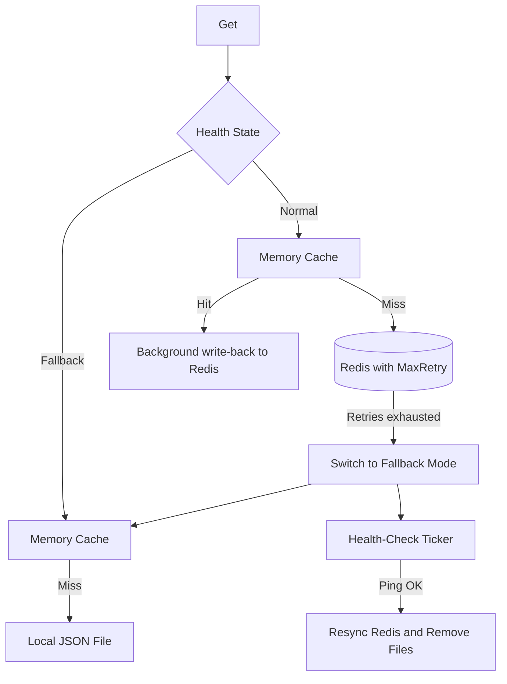

Last updated: 2026-10-07

> [!NOTE]
> This README was generated by [SKILL](https://github.com/agenvoy/skill-readme-generate), get the ZH version from [here](./doc/README.zh.md).

---

<strong>KEEP READING WHEN REDIS GOES DOWN!</strong>

---

> A Go Redis fallback library with in-memory and local file tiers, health-check recovery, and TTL-preserving resync

## Table of Contents

- [Features](#features)
- [Architecture](#architecture)
- [License](#license)
- [Author](#author)

## Features

> `go get github.com/pardnchiu/go-redis-fallback` · [Documentation](./doc/doc.md)

- **Three-Tier Read Fallback** — `Get` queries the memory cache, Redis, and local JSON files in order and returns on the first hit, so reads keep working while Redis is unreachable.
- **Mode Switch on Read Failure** — When Redis reads exhaust their retries, the call switches to fallback mode on the spot, starts the health checker, and answers from the local tiers in the same call.
- **Read-Repair** — In normal mode, memory-cache hits are written back to Redis in the background, filling in keys the recovery batch did not cover.
- **Full Resync on Recovery** — Once a health-check ping succeeds, the library loads local JSON files into memory, pipelines them to Redis in batches of 100 with their remaining TTL, then removes the local files.
- **Lazy Expiry on Read** — Every tier checks TTL on read and drops expired entries from both memory and disk, backed by a background sweep every 30 seconds.

## Architecture

> [Full Architecture](./doc/architecture.md)

```mermaid
graph TB
    Get[Get] --> Mode{Health State}
    Mode -->|Normal| Mem1[Memory Cache]
    Mem1 -->|Miss| Redis[(Redis with MaxRetry)]
    Mem1 -->|Hit| Repair[Background write-back to Redis]
    Redis -->|Retries exhausted| Fallback[Switch to Fallback Mode]
    Mode -->|Fallback| Mem2[Memory Cache]
    Fallback --> Mem2
    Mem2 -->|Miss| File[Local JSON File]
    Fallback --> Checker[Health-Check Ticker]
    Checker -->|Ping OK| Recover[Resync Redis and Remove Files]
```

## License

This project is licensed under the [MIT LICENSE](LICENSE).

## Author

Just [open an issue](https://github.com/pardnchiu/go-redis-fallback/issues/new) to share an idea.

---

©️ 2025 [邱敬幃 Pardn Chiu](https://www.linkedin.com/in/pardnchiu)
