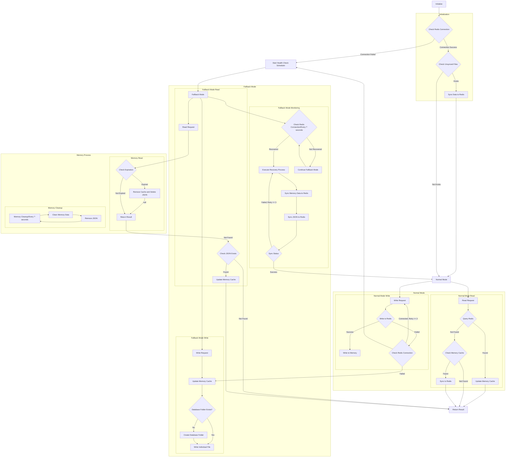

# Redis Fallback

> 一個 Golang Redis 降級方案，當連線不可用時自動降級至本地存儲，並在連線恢復時實現自動復原。
>
> 延伸自 [php-redis](https://github.com/pardnchiu/php-redis)、[php-cache-fallback](https://github.com/pardnchiu/php-cache-fallback) 和 [php-session-fallback](https://github.com/pardnchiu/php-session-fallback) 的整合概念

[](README.zh.md) 
[](LICENSE)
[](https://github.com/pardnchiu/go-redis-fallback/releases)
<br>
[](README.md)
[](README.zh.md) 

## 三大主軸

### 三層儲存架構
記憶體快取 + Redis + 本地檔案儲存，具備自動容錯機制

### 優雅降級並自動復原
降級時會定期監控 Redis 健康狀態，在連線復原時自動同步資料與清理本地檔案

### 確保資料完整度
回退模式期間將資料儲存為 JSON 檔案以防止遺失，並支援 TTL

## 流程圖

<details>
<summary>點擊查看</summary>



</details>

## 依賴套件

- [`github.com/redis/go-redis/v9`](https://github.com/redis/go-redis/v9)
- [`github.com/pardnchiu/go-logger`](https://github.com/pardnchiu/go-logger)<br>
  如果你不需要，你可以 fork 然後使用你熟悉的取代。更可以到[這裡](https://forms.gle/EvNLwzpHfxWR2gmP6)進行投票讓我知道。

## 使用方法

### 安裝
```bash
go get github.com/pardnchiu/go-redis-fallback
```

### 初始化 / Initialization
```go
package main

import (
  "log"
  "time"
  
  rf "github.com/pardnchiu/go-redis-fallback"
)

func main() {
  config := rf.Config{
    Redis: &rf.Redis{
      Host:     "localhost",
      Port:     6379,
      Password: "",
      DB:       0,
    },
  }

  // Initialize
  client, err := rf.New(config)
  if err != nil {
    log.Fatal(err)
  }
  defer client.Close()

  // Store data (with TTL support)
  err = client.Set("user:1", map[string]string{
    "name":  "John",
    "email": "john@example.com",
  }, 5*time.Minute)

  // Get data
  value, err := client.Get("user:1")
  if err == nil {
    log.Printf("Value: %v", value)
  }

  // Delete data
  err = client.Del("user:1")
}
```

## 配置介紹 / Configuration
```go
type Config struct {
  Redis   *Redis   // Redis configuration (required)
  Log     *Log     // Log configuration (optional)
  Options *Options // System parameters and fallback settings (optional)
}

type Redis struct {
  Host     string // Redis server host address (required)
  Port     int    // Redis server port number (required)
  Password string // Redis authentication password (optional, empty means no auth)
  DB       int    // Redis database index (required, usually 0-15)
}

type Log struct {
  Path      string // Log directory path (default: ./logs/redisFallback)
  Stdout    bool   // Enable console log output (default: false)
  MaxSize   int64  // Maximum size before log file rotation (bytes) (default: 16MB)
  MaxBackup int    // Number of rotated log files to retain (default: 5)
  Type      string // Output format: "json" for slog standard, "text" for tree format (default: "text")
}

type Options struct {
  DBPath      string        // File storage path (default: ./files/redisFallback/db)
  MaxRetry    int           // Redis retry count (default: 3)
  MaxQueue    int           // Write queue size (default: 1000)
  TimeToWrite time.Duration // Batch write interval (default: 3 seconds)
  TimeToCheck time.Duration // Health check interval (default: 1 minute)
}
```

## 可用函式

### 實例管理

- **New** - 建立新的實例
  ```go
  client, err := rf.New(config)
  ```
  - 初始化 Redis 連接
  - 設定日誌系統
  - 檢查未同步檔案

- **Close** - 關閉實例
  ```go
  err := client.Close()
  ```
  - 關閉 Redis 連接
  - 清空待處理寫入
  - 釋放系統資源

### 資料管理

- **Set** - 插入資料<br>
  Redis 失效時自動切換至本地儲存
  ```go
  err := client.Set("key", value, ttl)
  ```

- **Get** - 取得資料<br>
  記憶體快取為第一層，Redis 為第二層，本地檔案為回退層
  ```go
  value, err := client.Get("key")
  ```

- **Del** - 刪除資料
  ```go
  err := client.Del("key")
  ```

### 儲存模式

- 正常模式
  > Redis 可用
  - 優先寫入 Redis
  - 成功後更新記憶體快取
  - 背景同步確保一致性
    
- 回退模式
  > Redis 無法使用
  - 立即更新記憶體快取
  - 將寫入操作加入佇列
  - 批次寫入本地檔案
  - 監控 Redis 健康狀態

### 回退流程 / Fallback

- 健康監控
  > 定期檢查 Redis 連接狀態
  - 每 TimeToCheck 間隔自動執行
  - Redis 可用時嘗試復原

- 批次操作
  > 回退期間最佳化效能
  - 在記憶體中將寫入加入佇列
  - 每 TimeToWrite 間隔批次寫入檔案
  - 復原期間批次同步至 Redis

- 資料持久化
  > 使用 MD5 編碼的分層檔案儲存
  - 檔案根據金鑰雜湊儲存在巢狀目錄中
  - JSON 格式包含中繼資料：金鑰、資料、類型、時間戳、TTL

## 檔案儲存結構
> 使用 MD5 編碼實現分層目錄
```
{DBPath}/db/
├── 0/                   # Redis database number
│   ├── ab/              # First 2 characters of MD5
│   │   ├── cd/          # 3rd-4th characters of MD5
│   │   │   ├── ef/      # 5th-6th characters of MD5
│   │   │   │   └── abcdef1234567890abcdef1234567890.json
```

檔案內容格式
```json
{
  "key": "original key value",
  "data": "actual stored data",
  "type": "interface {}",
  "timestamp": 1234567890,
  "ttl": 300
}
```

## 功能進度
> 持續改進中

- 一般操作
  - [x] Get - 取得資料
  - [x] Set - 儲存資料
  - [x] Del - 刪除金鑰值
  - [ ] Exists - 檢查金鑰是否存在
  - [ ] Expire/ExpireAt - 設定過期時間
  - [ ] TTL - 取得剩餘存活時間
  - [ ] Keys - 尋找符合模式的金鑰
  - [ ] Scan - 迭代金鑰
  - [ ] Pipeline - 批次指令
  - [ ] TxPipeline - 交易批次

- 字串操作
  - [ ] SetNX - 不存在時設定
  - [ ] SetEX - 設定並指定過期時間
  - [ ] Incr/IncrBy - 遞增數值
  - [ ] Decr/DecrBy - 遞減數值
  - [ ] MGet/MSet - 批次取得/設定多個金鑰值

- 雜湊操作
  - [ ] HSet/HGet - 設定/取得雜湊欄位
  - [ ] HGetAll - 取得所有欄位和值
  - [ ] HKeys/HVals - 取得所有欄位名稱/值
  - [ ] HDel - 刪除雜湊欄位
  - [ ] HExists - 檢查欄位是否存在

- 列表操作
  - [ ] LPush/RPush - 從左側/右側新增元素
  - [ ] LPop/RPop - 從左側/右側移除元素
  - [ ] LRange - 取得範圍元素
  - [ ] LLen - 取得列表長度

- 集合操作
  - [ ] SAdd - 新增元素至集合
  - [ ] SMembers - 取得所有集合成員
  - [ ] SRem - 從集合移除元素
  - [ ] SCard - 取得集合基數
  - [ ] SIsMember - 檢查元素是否在集合中

### 回退模式無法支援的功能

- 阻塞操作
  - BLPop/BRPop - 阻塞式左側/右側彈出

- 有序集合操作
  - ZAdd - 新增元素至有序集合
  - ZRange/ZRevRange - 依分數取得範圍
  - ZRank/ZRevRank - 取得元素排名
  - ZScore - 取得元素分數
  - ZRem - 移除元素

- 發布/訂閱
  - Publish - 發布訊息
  - Subscribe - 訂閱頻道

- Lua 腳本
  - Eval/EvalSha - 執行 Lua 腳本

## 授權條款

此原始碼專案採用 [MIT](LICENSE) 授權。

## 作者


<h4 style="padding-top: 0">邱敬幃 Pardn Chiu</h4>

<a href="mailto:dev@pardn.io" target="_blank">
  
</a> <a href="https://linkedin.com/in/pardnchiu" target="_blank">
  
</a>

***

©️ 2025 [邱敬幃 Pardn Chiu](https://pardn.io)