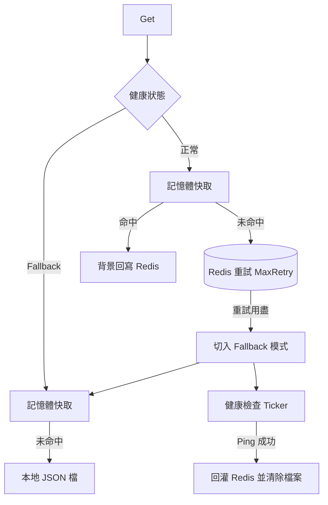

最後更新：2026-10-07

> [!NOTE]
> 此 README 由 [SKILL](https://github.com/agenvoy/skill-readme-generate) 生成，英文版請參閱 [這裡](../README.md)。

***

<strong>KEEP READING WHEN REDIS GOES DOWN!</strong>

***

> Go Redis 斷線降級函式庫，具備記憶體與本地檔案接手、健康檢查自動恢復與保留 TTL 回灌

## 目錄

- [功能特點](#功能特點)
- [架構](#架構)
- [授權](#授權)
- [Author](#author)

## 功能特點

> `go get github.com/pardnchiu/go-redis-fallback` · [完整文件](./doc.zh.md)

- **三層讀取降級** — `Get` 依序查詢記憶體快取、Redis、本地 JSON 檔，任一層命中即回傳，Redis 失聯時讀取不中斷。
- **讀取失敗即切換模式** — Redis 讀取重試用盡時，當下切入 fallback 模式並啟動健康檢查，同一次呼叫直接改由本地層回應。
- **讀取修補（Read-repair）** — 正常模式下記憶體命中的值會在背景回寫 Redis，補齊恢復批次未覆蓋的鍵。
- **恢復時完整回灌** — 健康檢查 Ping 成功後掃描本地 JSON 檔載入記憶體，以 Pipeline 每 100 筆一批、依剩餘 TTL 回寫 Redis，再清除本地檔案。
- **讀取時惰性過期** — 每一層讀取都檢查 TTL，過期即同步移除記憶體與檔案，並由每 30 秒的背景掃除兜底。

## 架構

> [完整架構](./architecture.zh.md)

## 授權

本專案採用 [MIT LICENSE](../LICENSE)。

## Author

Just [open an issue](https://github.com/pardnchiu/go-redis-fallback/issues/new) to share an idea.

***

©️ 2025 [邱敬幃 Pardn Chiu](https://www.linkedin.com/in/pardnchiu)
