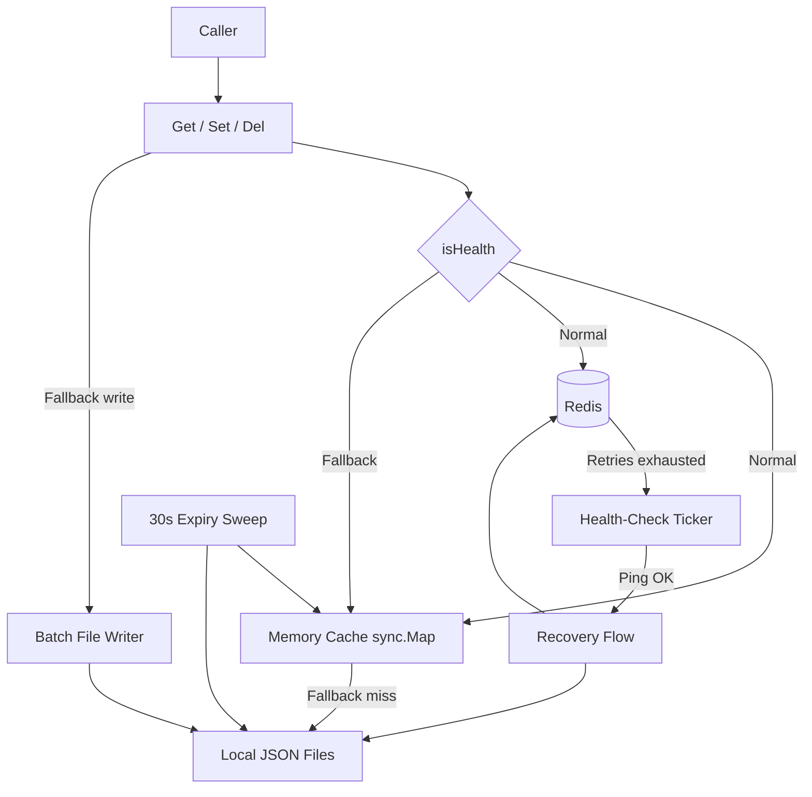
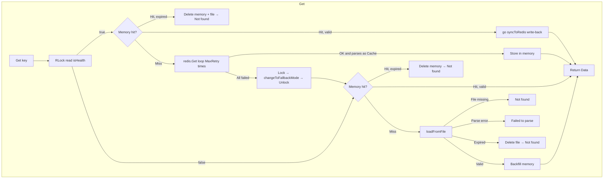
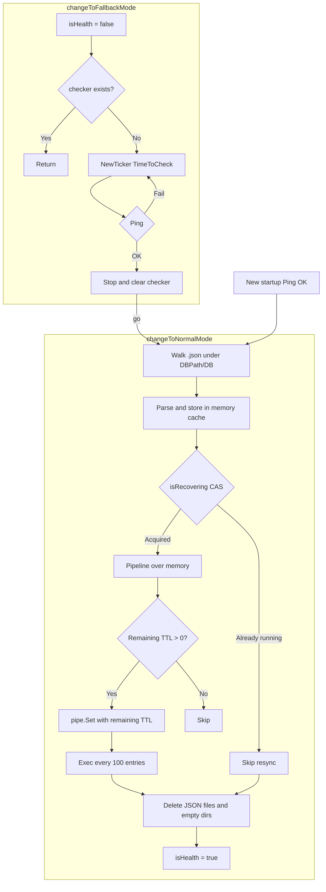
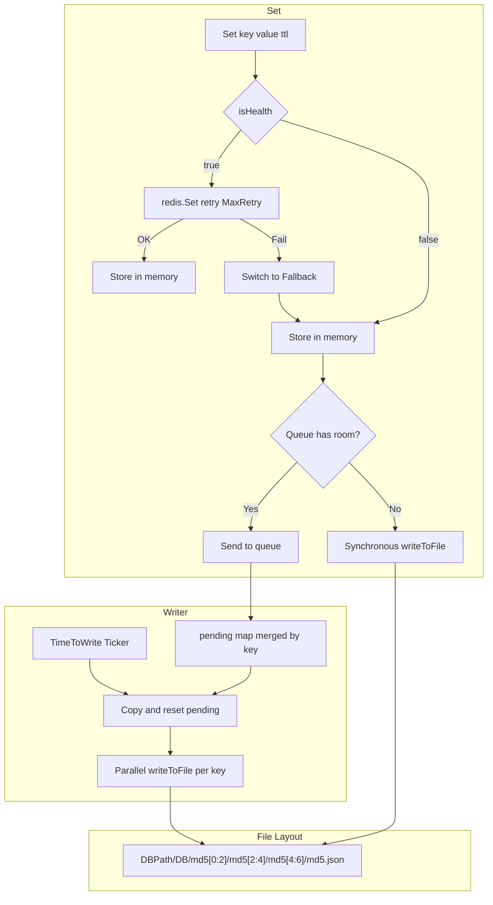
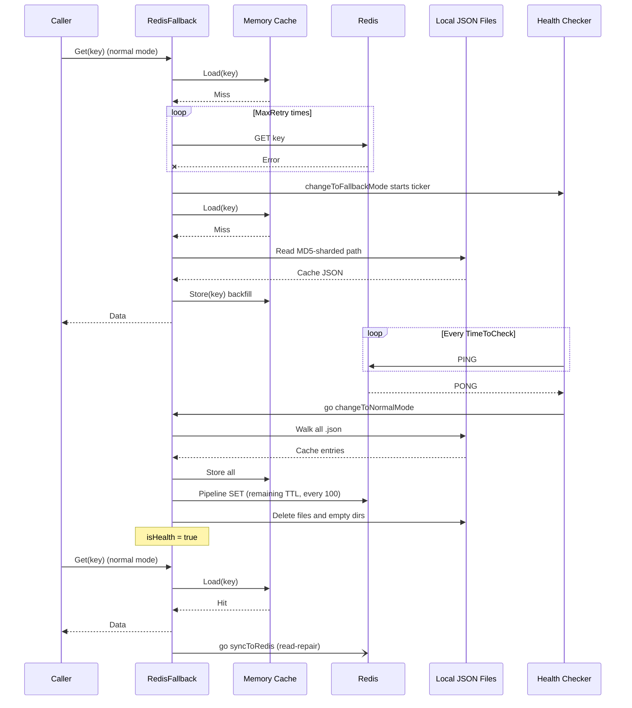
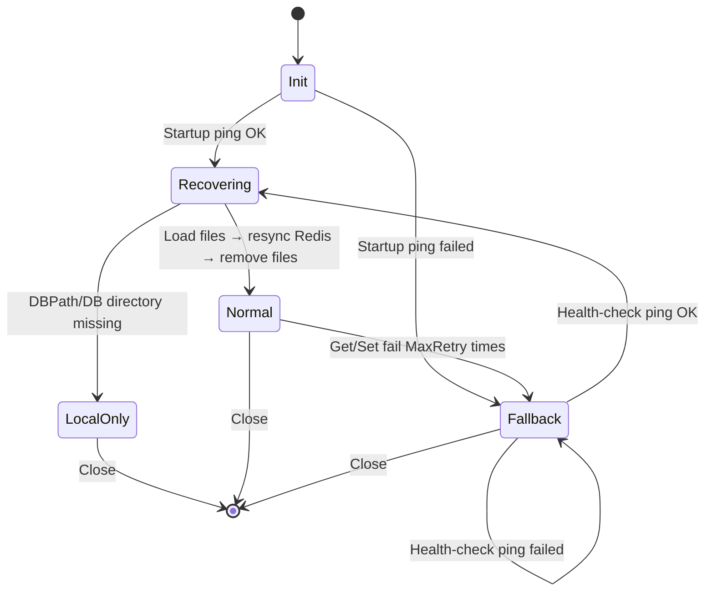

# go-redis-fallback - Architecture

Last updated: 2026-10-05

> Back to [README](../README.md)

## Overview

## Module: Read Path (get.go)

Routes by health state; normal mode is memory-first with read-repair, and degrades within the same call on failure.

## Module: Recovery (sync.go)

Once the health check detects Redis is back, local files are resynced to Redis through memory and local state is cleared.

## Module: Write Path and File Layout (set.go / writer.go / unit.go)

Fallback writes land in memory first, then merge through a queue into batched file writes; file paths are sharded three levels deep by the key's MD5.

## Data Flow

The full sequence from a Redis outage, through read fallback, to read-repair after recovery.

## State Machine

***

©️ 2025 [邱敬幃 Pardn Chiu](https://www.linkedin.com/in/pardnchiu)
