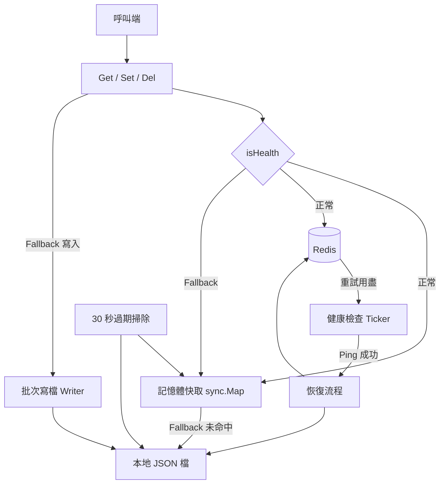
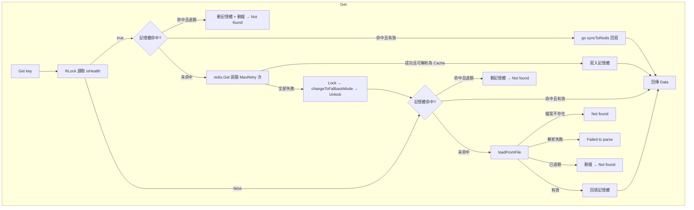
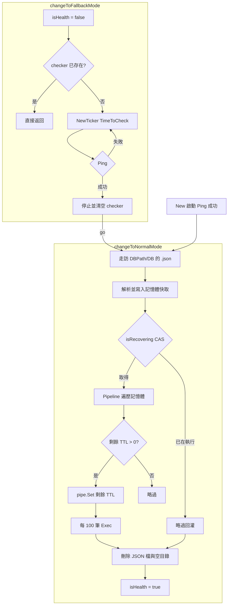
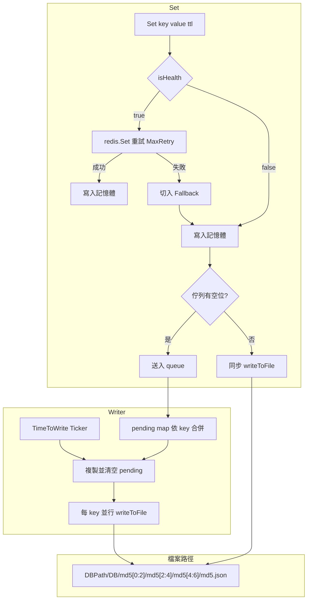
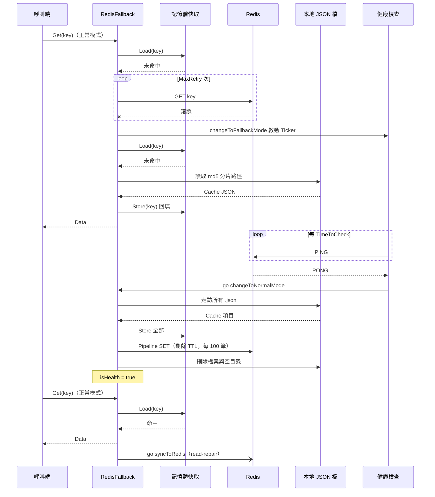
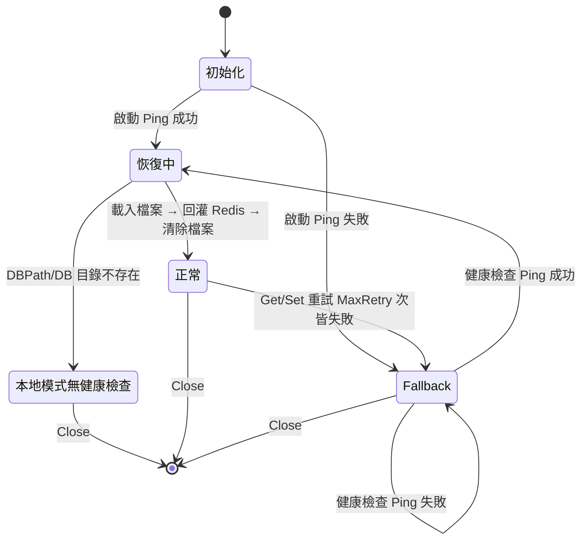

# go-redis-fallback - 架構

最後更新：2026-10-05

> 返回 [README](./README.zh.md)

## 概覽

## Module: 讀取路徑（get.go）

依健康狀態分流，正常模式以記憶體優先並 read-repair，失敗時於同一次呼叫內降級。

## Module: 恢復（sync.go）

健康檢查偵測 Redis 恢復後，將本地檔案經記憶體回灌至 Redis 並清除本地狀態。

## Module: 寫入與檔案佈局（set.go / writer.go / unit.go）

Fallback 寫入先進記憶體，再經佇列合併後批次落檔；檔案路徑以 key 的 MD5 三層分片。

## 資料流

Redis 失聯、讀取降級，至恢復後 read-repair 的完整序列。

## 狀態機

***

©️ 2025 [邱敬幃 Pardn Chiu](https://www.linkedin.com/in/pardnchiu)
